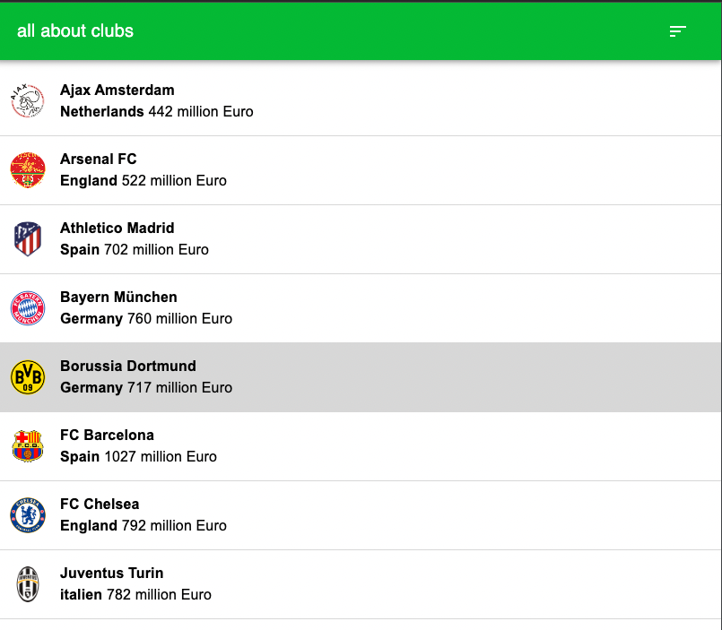
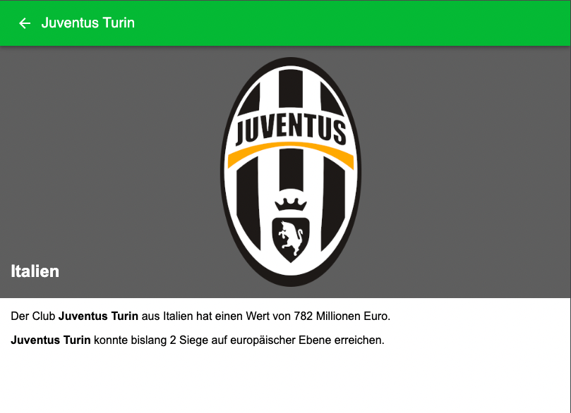

# aaa-challenge

Coding challenge as part of a dev interview.

## How To

`npm run dev` ... serve locally

`npm run test` ... run tests

## Tech used

I did not use the provided templates. Instead, I decided to go with `Vite` (instead of `create-react-app` based template).
`Vite` offers a far better dev experience IMO.

However, the project still relies on React, TS and Material UI.

## Misc

- I timeboxed my dev time to one afternoon.
- I managed to implement routing (details view can be shared via a URL).
- I added `i18next` for internationalization but I did not add translations for everything (currently just the country names).
- I added some basic tests (`Details.spec.ts`) using `Vitest`. Provided more time, I would have added more.

## Screenshots

List view:

Details view:
